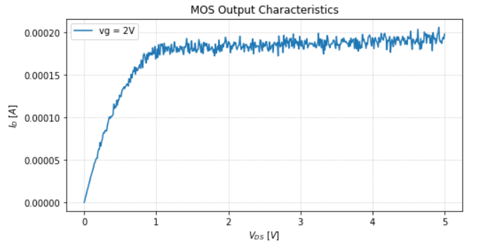
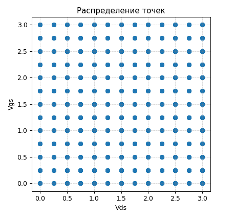
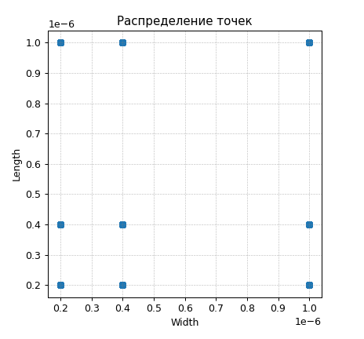
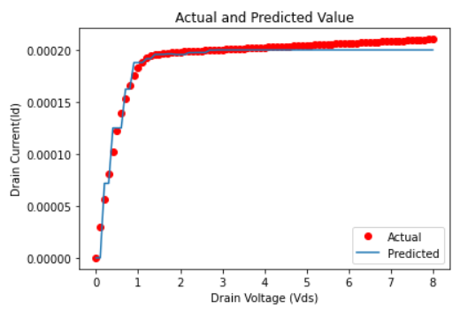
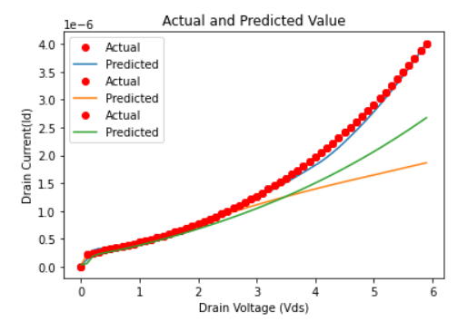
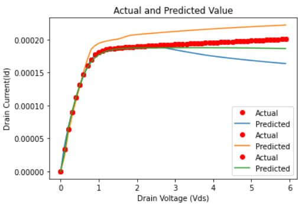
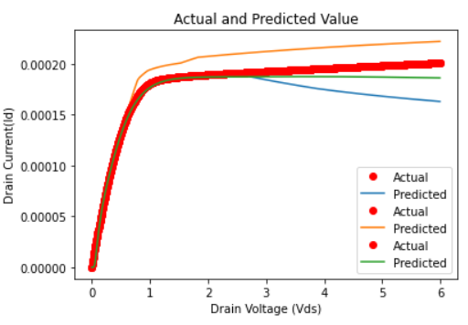
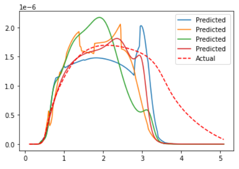
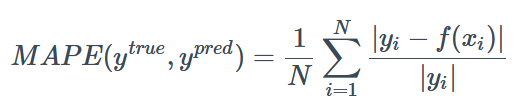

# Построение модели MOSFET при помощи методов машинного обучения

- цель работы
- подход к решению
- что было сделано
- достигнутые результаты 
- какие проблемы решены, какие не решены
- что делать дальше

В данный момент для моделирования работы транзистора применяют 
модели, основанные на физике (например BSIM3v3).
Однако у использования данных моделей есть недостатки, 
такие как огромное количество параметров, которые необходимо 
достать из реальных транзисторов, и необходимость с новой 
структурой транзистора придумывать все новые физ. модели.

А давайте использовать модели, основанные только 
на данных собранных с реальных транзисторов и 
не использующие физику устройства. И тут приходит 
в голову применение методов машинного обучения.

## Первый этап. Генерация датасета

Нашими входными значениями будут величины, которые 
мы можем легче всего контролировать и измерять. В нашем случае, 
пусть это будут $V_ds$ (напряжение сток-исток), 
$V_gs$ (напряжение затвор-исток), $W$ (ширина затвора),
$L$ (длина затвора), $Т$ (температура). 
А выходными - $I_ds$ (ток сток-исток).

Ясно, что реальный транзистор будет иметь шумы. Причем шумы 
возникают как в следствие технического разброса, 
так и как погрешности приборов. Поэтому была идея добавить 
смещения во входные параметры (L, W), выходные параметры (I) 
и скрытые параметры (подвижность и т.п.).

Смещения - нормальное распределение (входные и выходные - 3%, скрытые-5%)

Точки на входе:

Использовано 9 транзисторов.

## Машинное обучение

Хотя модель и тренируется только на данных, 
но она должна быть в меру "физична".

### Бустинг

Были применены несколько видов бустинга. 
Лучшими оказались XBoost и CatBoost.

Хотя создание модели и было почти моментальным и 
точность можно улучшать с увеличением кол-ва точек в датасете.
Но тут есть несколько проблем:

- Больше точек - лучше модель
- Плохо предсказывает вне области обучения
- Решение не обладает гладкостью

### Нейронные сети

#### Подготовка данных

Было использовано несколько способов 
предподготовки данных для машинного обучения:
MinMax, Scaler, действие логарифма.

Лучшим оказалось использование логарифмирования 
входных напряжений, а затем нормализация (среднее = 0, 
среднеквадрат отклонение = 1).

Затем при помощи бейсовcкой оптимизации (модуль Hyperopt) 
находились лучшие параметры архитектуры сети.

Но к сожалению производные выглядят совсем не очень. 
Но намного лучше, чем от бустинга :)

Метрика МАРЕ:

В итоге вышли значения для метрики MAPE:

- внутри области обучения 12%
- вне области обучения 32%

При этом, если увеличивать кол-во итераций, 
то MAX MSE (сред квадр отклонение) не меняется. 
Это говорит о том, что существуют выбросы в предсказаниях сетки.

Также есть тенденция при увеличении точности внутри области 
уменьшается точность вне области обучения.

Возможные дальнейшие шаги:
- Применение динамического взятия точек для датасета. 
  То есть брать больше точек в точках наибольшего изменения 
  функции и точках наибольшей важности.
  
- Еще что-то