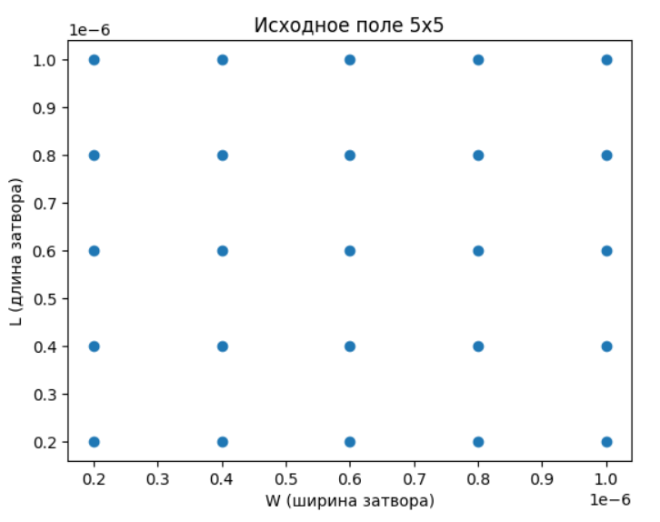
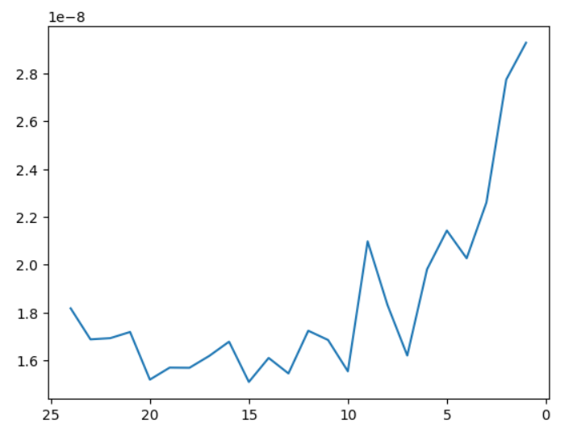
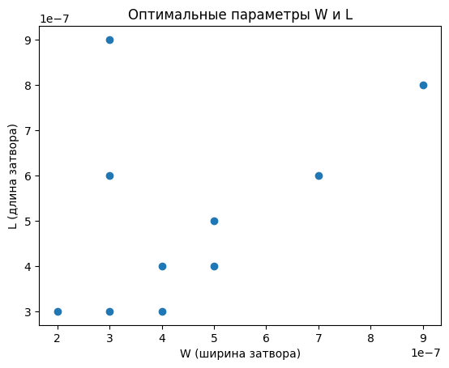
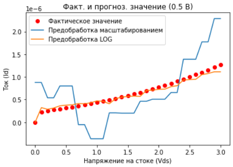
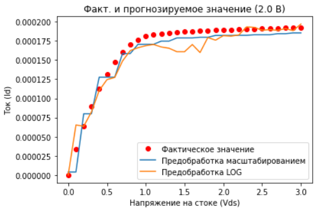
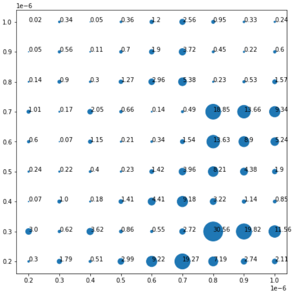
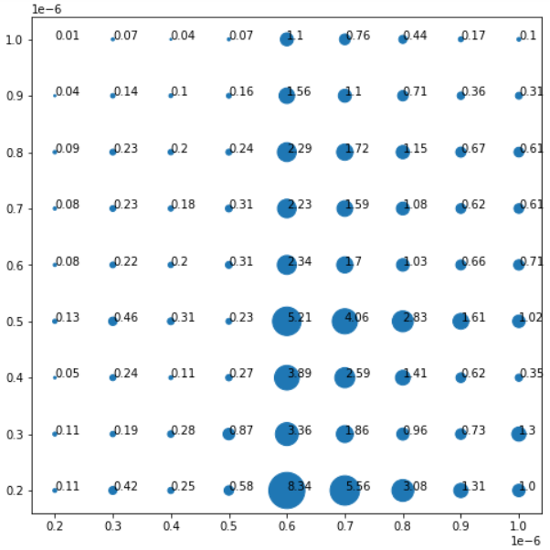
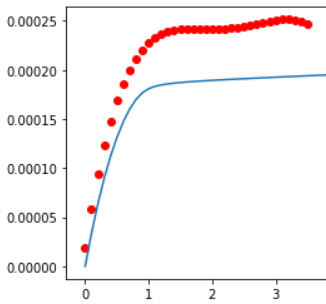
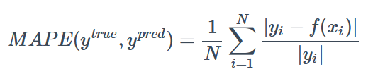

# Промежуточные выводы

## Поиск оптимального количества транзисторов

Была идея определить наименьшее количество транзисторов, необходимых для обучения без ухудшения качества.

Для начала прикиним примерное количество. Пусть у нас есть некоторое поле 
различных параметров W (ширины) и L (длины) (25 транз.). Давайте будет как-то рандомно выкидывать транзисторы 
и смотреть на качество. Метрикой была выбрана MSE (среднеквадратичное отклонение).

Сделав несколько измерений (5) и усреднив получили такой график на рисунке 2 (ниже).
Видно, что резкое возрастание ошибки возникает примерно на 10 транзисторах.

Рис 2. Зависимость среднеквадратичной ошибки от количества точек

Теперь определим, какие транзисторы дают макисмальный вклад в качество обуч. модели.
Возьмем теперь поле побольше (81 транз.) И так же будет искать "наиболее ненужные" транзисторы.
Вышло примерное как-то так:

Но стоит понимать, что каждый раз картинка будет иметь немного другой вид, 
так что это лишь как приблизительные расположения.

## Использование бустинга

Была идея, что методами бустинга можно добиться быстро хороших результатов, 
несмотря при этом на гладкость функций.

Применяя, различные настройки и методы предобработки (масштабированием 
и LOG (логарифмирования)) вышло:

Хотя каждая из моделей на всей области обучения ведут себя не очень хорошо, 
но есть участки где они показывают наилучшие результаты. Замечу, что 
скорость их намного больше, чем сетей.

Например, неоднородность качества предсказания можно увидеть на картинках ниже.
По осям значения для W и L. Цифрами показаны значения MSE (умноженные на 10^8) 
для различных транзисторов. (Чем больше кружок, тем больше ошибка. 
Кружки между двумя рисунками не соотносятся)

Рис. Для модели с предобработкой масштабированием. (умноженные на 10^8)

Рис. Для модели с предобработкой LOG. (умноженные на 10^8)

## Применение полиномов

Была идея аппроксимировать полиномами. Самыми подходящими 
оказались полиномы 4-ого порядка. (Основывался на метрике MSE).

Вывод - быстро, гладко, но большие ошибки. Пример:

## Изменение входных параметров

Идея была взята из статьи (https://ieeexplore.ieee.org/abstract/document/9394643).

Помимо входных параметров, которые уже есть (Vds, Vgs, W, L, T) подставлять 
на вход сети некоторые полиномы из этих параметров.

Пример полиномов: Vgs**2, Vds**2, Vds * Vgs, Vds**2 * Vgs, Vds * Vgs**2,
Vgs/L, Vds/L, Vgs**2 / L, Vds**2 / L, Vds * Vgs / L,
Vgs * W, Vds * W, Vgs**2 * W, Vds**2 * W, Vds * Vgs * W, 1 / T и т.п.

В итоге в прошлом лучшие решения сетей давали: 12% (MAPE) (в среденем - 15%).

То при применении полиномов на входе выходит: 10% (MAPE) (в среденем - 11%)

Метрика MAPE:

Возможные дальнейшие шаги:

- Объединение полученных результатов воедино
- Применение динамического взятия точек для датасета.
  То есть брать больше точек в точках наибольшего изменения функции и точках наибольшей важности
  
- Объединение несколько решений в одно. Например две модели бустинга с различными предобработками или обьединение методов кэтбустинга с сетями.
-

